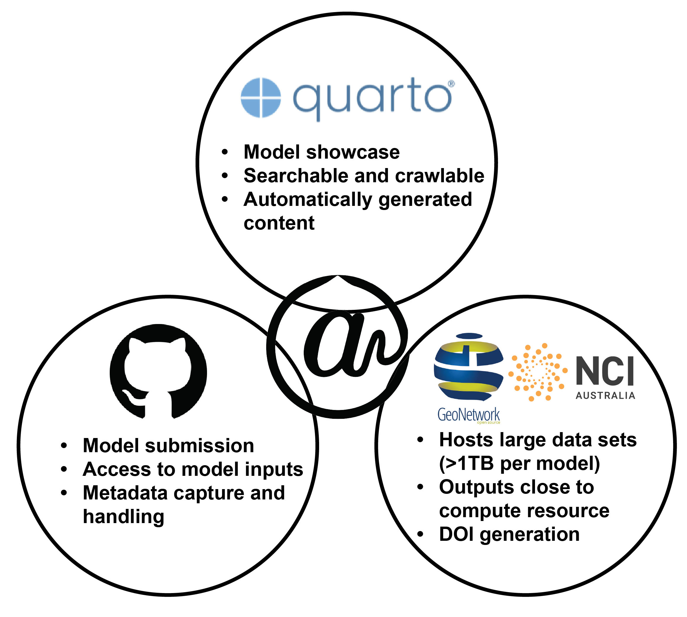

---
# =============================================================================
# about.qmd — About M@TE page
# =============================================================================
title: "About M@TE"
---

```{=html}
<div class="about-page">
```

# About M@TE

M@TE is designed to meet geoscientists where they are: from educators
and students using visualizations in the classroom to researchers
developing and benchmarking new numerical models. It lowers the
learning curve of numerical models and bridges the gap between
traditional geology and numerical geosciences.

```{=html}
<a href="models/index.html"
   class="btn btn-primary"
   style="background:#D64000; border-color:#D64000; font-size:16px; padding:0.5rem 1.5rem; margin: 0.5rem 0 1.5rem;">
  Browse Models →
</a>
```

**M@TE enables you to:**

- **Explore and visualize models** through an intuitive web interface: play animations, use them in your teaching or to better understand Earth system concepts.
- **Download and build on models** by accessing input files and configuration scripts to reproduce or expand upon simulations on your own.
- **Analyze and benchmark model outputs** by comparing results across models and datasets without having to recreate simulations from scratch.
- **Upload your own models** using streamlined tools for packaging code, metadata and outputs. These are stored, preserved and assigned a DOI for citation. *(Currently by invitation only, as we are being intentional about showcasing a diverse and representative set of models.)*

**Together we build reproducible, reusable, robust models — it takes a village — so please cite the models you use.**



---

## How does M@TE work?

M@TE combines a user-friendly experience with a robust backend built
on widely adopted, sustainable infrastructure. Users browse model
summaries through the website, which links to GitHub and NCI
repositories for downloading code and outputs. Behind the scenes,
carefully chosen tools ensure consistency, accessibility and
long-term preservation.

**Key design choices include:**

### RO-Crates for packaging

Model metadata is packaged using the [RO-Crate standard](https://www.researchobject.org/ro-crate/mate), a lightweight JSON-LD format that captures rich metadata and
references model components (e.g. code, inputs, outputs,
publications, authors and persistent identifiers). This
ensures models are machine-readable and FAIR (Findable,
Accessible, Interoperable, Reusable).

### GitHub for submission and validation

Models are submitted through structured
[GitHub issue templates](https://github.com/ModelAtlasofTheEarth/model_submission).
Metadata is automatically validated and enriched
via GitHub Actions, which connect to external services such as
Crossref, DataCite and ORCID.

### Quarto for showcasing

The M@TE website is built with [Quarto](https://quarto.org),
a scientific publishing system that delivers a fast, lightweight interface for
browsing models. It integrates figures, animations and interactive content to
make models discoverable and usable across different audiences.

### NCI GeoNetwork for storage and preservation

Model outputs are stored and preserved through the National Computational Infrastructure (NCI)
[GeoNetwork](https://geonetwork.nci.org.au/). This system supports terabyte-scale data,
assigns persistent DOIs and ensures discoverability through standard catalog services.

---

## Content ingestion mechanism

Each scientific model has its own repository in the `ModelAtlasofTheEarth` GitHub organisation. When a model is ready for publication, a bunch or steps occur:

TODO: outline the steps for model repo + output -> website publication.

```{=html}
</div>
```

