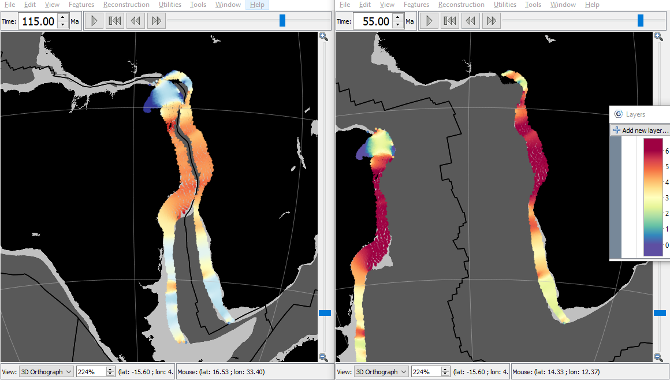

#### Download GPlates 2.3:-

Download GPlates 2.3 and compatible geodata from the [Download](/download) page.

#### What's new in GPlates 2.3:-

* Deformation:
    * Added tectonic subsidence due to crustal stretching and subsequent cooling of lithosphere.
        * Numerically solves 1D temperature advection-diffusion equation over lithosphere depth at each surface point:
            * Solved during and after crustal stretching.
        * Initial conditions:
            * Linear temperature gradient over lithosphere depth (equilibrium state).
            * Zero subsidence.
    * Improved stability of crustal thinning calculations by clamping strain rate.
* Rendering:
    * Supports high-DPI displays (eg, Apple Retina).
    * Added two new age palettes (*traditional* and *modern*) along with existing *legacy*.
    * Tool palette on macOS now looks similar to Windows and Linux.
* Export:
    * Support export of GeoJSON files.
    * Added choice in *general* resolved topology export (in relation to sub-segments of topological line segments).
    * OGR GMT exports now have dateline wrapping disabled by default (previously enabled by default).
* Layers:
    * New option in yellow layer to extend rotation sequences beyond oldest times in rotation file:
        * Such that reconstructed geometries are not snapped back to present day positions.
* Memory usage:
    * Reduced memory usage of geometries:
        * Multi-points reduced 40%.
        * Polylines and polygons reduced 33%.
    * Reduced rotation tree memory usage by 25%.
* Build:
    * Overhauled build system to use modern CMake 3.
    * Create standalone binary packages *within* the build system (for macOS, Windows and Linux).
        * Standalone recursively installs dependency libraries into package.
        * Windows supports *NSIS installer* and *ZIP archive* (both standalone).
        * macOS supports *DMG disk image* (standalone).
            * Signs GPlates bundle, its internal contents and final DMG with a Developer ID certificate.
            * Notarization by Apple still manually done outside build system.
        * Linux supports:
            * *Debian package* (non-standalone: system package manager installs dependencies).
            * *Tarball* (standalone: pre-packaged dependencies).
    * Library dependencies:
        * Significant upgrade to *Qt version 5* (from version 4).
        * GPlates and pyGPlates now link to *zlib* (no longer require the gzip program).
        * Ported Hellinger Python code to *Python 3*, and *NumPy >= 1.12*.
        * *C++11* is now the minimum C++ language requirement.
            * GDAL 2.3 and above require it.
            * CGAL 5 and above require *C++14*.
    * Updated GPlates icon to [new blue icon](/download/#download-gplates-logo).
    * Changed version numbering to support *pre-release* packaging (dev, alpha, beta, release candidate):
* Bug fixes:
    * Fixed macOS scrollbar in layers window obscuring underlying layer controls.
        * Fixed exporting CitcomS topological segments using a header format CitcomS is unable to pre-process:
            * This resulted in missing subduction polarities, for example.
            * Behaviour now matches GPlates 2.1.
    * Fixed exception/crash in the following topological scenario:
        * a topological polygon sub-segment is a rubber-banded resolved topological line, and
        * shared by two topological polygons, and
        * we're retrieving its sub-sub-segments (eg, in *general* resolved topology export).
    * Fixed topology resolving at triple junction with rubber bands converging on a single point.
    * Fixed crash when a point inside a deforming network's rigid block is not always detected as such.
    * Raster fixes:
        * Fixed bug where part of a raster touching dateline is stretched right across map (in 2D map views).
        * Fixed incorrect clipping of high resolution floating-point rasters in map view.
        * Fixed missing square sections in raster when using non-zero central meridians in map view.
        * Fixed *regional* imported raster not getting exported with same extents.
    * GPlates log file now saved to writable location when current working directory lacks write permission:
        * For example, save to `C:/Users/<USER>/AppData/Local/GPlates/` when GPlates installed to `C:/Program Files/`.
    * Enable writing of `.json` files (not just `.geojson`).
    * Fixed PLATES rotation file sometimes having unsaved changes (immediately after loading).
    * Fixed one GROT file getting saved with the contents of another GROT file.
        * And also crashing when trying to save the first GROT file after unloading the second one.
    * Kinematics tool:
        * Angular velocity (rads/Myr) is now always positive since stage rotation *pole* is arbitrary,
        * because can negate pole/angle pair and get same rotation, so just take absolute value.
    * Fixed crash on Linux when opening a save file dialog to get project or feature collection file name.
    * Fixed default user preferences not getting initialised properly on some systems.
    * Fixed dateline wrapping parameter not getting used for export to OGR GMT format.
    * Fixed polyline around the equator not getting intersected with small polygon crossing it.
    * Fixed some zero area dateline sliver polygons giving incorrect areas (multiples of PI instead of zero).
    * Fixed polygon around the equator ending up with zero area instead of 2*PI (ie, half the globe).

...and other changes listed in the CHANGELOG file in the [GPlates source-code releases](/download).

#### What's next:-

Unfortunately we were unable to release some features currently in progress. So the following features will be in the next release:

* The first phase of generalized symbology:
    * Point symbols, line patterns, fill patterns.
    * With priority for subduction teeth.
* Tilting the globe:
    * To see 3D volumes better.
* A new *3D Perspective* projection view.
    * Alongside existing *3D Orthographic* view.
    * Farther objects appear smaller, as in the real world, unlike orthographic.
* Fix incorrect rendering of 3D volumes (and crashing) on some modern macOS hardware:
    * Provide overhauled OpenGL graphics pipeline, upgraded for relatively modern hardware (in last ten years).

Also currently looking into:
* Improved integration of external vector formats (Shapefiles, etc). 
* Time-dependent 3D volumes.

